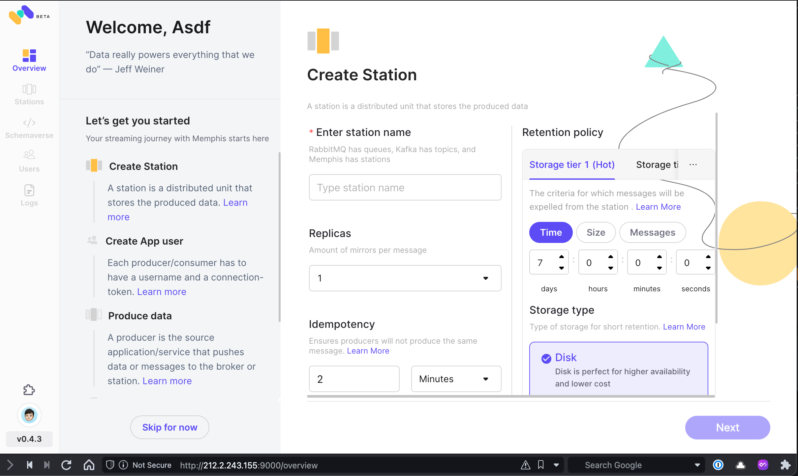

# memphis-deploy

Deploy memphis (alternative to traditional message brokers) on docker and kubernetes.



## Kubernetes

Deploy memphis on kubernetes with a single command.

> No helm, abstractions, or other tools required!

```bash
~ ➜ kubectl get all -n memphis
NAME                         READY   STATUS    RESTARTS   AGE
pod/mongo-7b99845986-8824f   1/1     Running   0          33m
pod/proxy-58f8d679c9-6q79v   1/1     Running   0          25m
pod/broker-m7sf8             0/1     Pending   0          7m58s
pod/broker-4vhc8             0/1     Pending   0          7m58s
pod/broker-9mhck             0/1     Pending   0          7m58s
pod/broker-sjd8l             1/1     Running   0          7m58s
pod/broker-2wbb6             1/1     Running   0          7m58s

NAME             TYPE           CLUSTER-IP      EXTERNAL-IP     PORT(S)                                                       AGE
service/mongo    ClusterIP      10.43.168.238   <none>          27017/TCP                                                     46m
service/broker   LoadBalancer   10.43.57.11     212.2.243.155   6666:32734/TCP,7770:30155/TCP,8222:30464/TCP,9000:31491/TCP   12m

NAME                    DESIRED   CURRENT   READY   UP-TO-DATE   AVAILABLE   NODE SELECTOR   AGE
daemonset.apps/broker   5         5         2       5            2           <none>          7m58s

NAME                    READY   UP-TO-DATE   AVAILABLE   AGE
deployment.apps/mongo   1/1     1            1           33m
deployment.apps/proxy   1/1     1            1           29m

NAME                               DESIRED   CURRENT   READY   AGE
replicaset.apps/mongo-7b99845986   1         1         1       33m
replicaset.apps/proxy-58f8d679c9   1         1         1       25m
replicaset.apps/proxy-748dd5d659   0         0         0       29m
```

### Deploy raw manifests

```bash
kubectl apply -f kubernetes/kubectl/
```

### Get loadbalancer IP

```bash
kubectl get -n memphis services
```

```bash
~ ➜ kubectl get -n memphis services
NAME     TYPE           CLUSTER-IP      EXTERNAL-IP     PORT(S)                                                       AGE
mongo    ClusterIP      10.43.168.238   <none>          27017/TCP                                                     45m
broker   LoadBalancer   10.43.57.11     212.2.243.155   6666:32734/TCP,7770:30155/TCP,8222:30464/TCP,9000:31491/TCP   12m
```

Open http://212.2.243.155:9000 (substitute the ip from above) in your browser to view the management UI.
